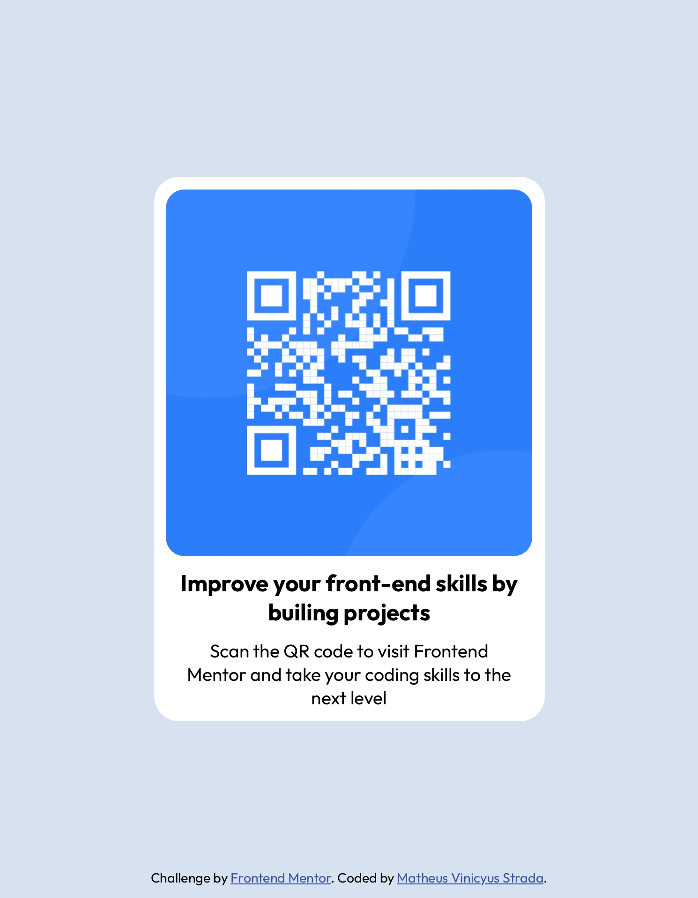
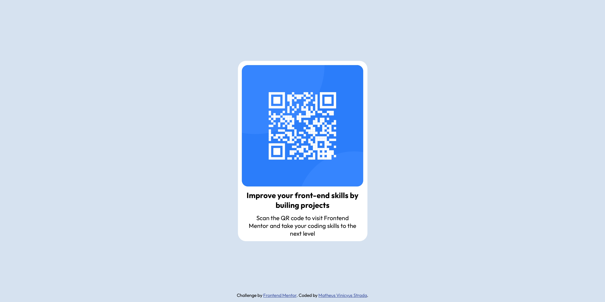

# Frontend Mentor - QR code component solution

Esta é uma solução para o [QR code component challenge on Frontend Mentor](https://www.frontendmentor.io/challenges/qr-code-component-iux_sIO_H). Os desafios do Frontend Mentor ajudam você a melhorar suas habilidades de codificação através da construção de projetos realistas.

## Índice

- [Overview](#overview)
  - [Screenshot](#screenshot)
  - [Links](#links)
- [Meu processo](#meu-processo)
  - [Construído com](#construído-com)
  - [O que eu aprendi](#o-que-eu-aprendi)
  - [Recursos úteis](#recursos-úteis)
- [Autor](#autor)
- [Agradecimentos](#agradecimentos)

## Overview

### Screenshot




### Links

- Solution URL: (https://zmatheus22.github.io/QR_code_component_Challenge/)

## Meu processo

### Construído com

- Marcação HTML5 semântica
- Propriedades personalizadas CSS
- Flexbox
- Mobile-first

### O que eu aprendi

- Aperfeiçoar a semântica do `HTML5`

```html
<main class="container">
  <section id="img">
    <!-- Imagem do QR -->
  </section>
  <section id="text">
    <article>
      <h1>Improve your front-end skills by builing projects</h1>
      <p>
        Scan the QR code to visit Frontend Mentor and take your coding skills to
        the next level
      </p>
    </article>
  </section>
</main>
```

- Utilização do `Flexbox` para centralizar o conteúdo do `HTML5`

```css
body {
  display: Flex;
  flex-direction: column;
  justify-content: center;
  align-items: center;
}
```

- Aperfeiçoar os conseitos de `Background`

```css
section#img {
  background: var(--White) url("../images/image-qr-code.png") no-repeat;
  background-size: cover;
  background-position: center center;
}
```

### Recursos úteis

- (https://codingfantasy.com/) - Isso me ajudou com a utilização do `Flexbox`, treinando e entendendo melhor o funcionamento.

## Autor

- Website - [strada.dev.br](https://strada.dev.br)
- Frontend Mentor - [@zMatheus22](https://www.frontendmentor.io/profile/zMatheus22)
- LinkedIn - [@Matheus Vinicyus Strada](https://www.linkedin.com/in/matheus-vinicyus-strada/)

## Agradecimentos

Agradeço o [@GrandeFiasco](https://www.youtube.com/@GrandeFiasco) por ter divulgado o [Frontend Mentor](https://www.frontendmentor.io/) com esse desafio.
